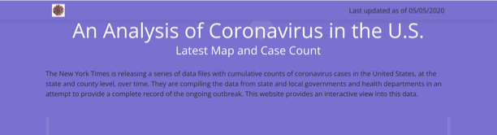

# COVID-19 Tracker Site

The COVID-19 tracker site displays updated COVID statistics captured by the NY Times. The site uses a CRONTAB and updates daily, providing details on the number of cases and the number of COVID-related deaths by state.

The underlying code leverages Flask, D3JS, Redis, and Celery and can be repurposed for similar tracking needs. 

### Sample Images from the Site

### Source: Data made available for download by The New York Times on GitHub
https://github.com/nytimes/covid-19-data
